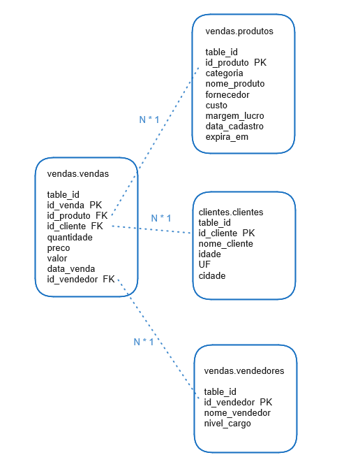

# Análise de dados de vendas com SQL

Neste repositório desenvolvi um caso de estudo para análise de vendas exclusivamente para SQL Server. 
O caso consiste em obter informações sobre as vendas de um dia para uma loja fictícia de vestuario e acessórios.

Perguntas como as descritas abaixo são respondidas; 

Qual foi o vendedor com maior valor vendido?
Qual foi o vendedor com maior ticket médio?
Qual foi o vendedor com maior ticket médio por periodo?
Qual faixa etária mais gastou na loja?
Quem vendeu melhor para a faixa etaria que gastou mais?

Desde a criação dos schemas, tabelas e consultas, foi utilizado Microsoft SQL Server 2019 

(RTM) - 15.0.2000.5 (X64)   Sep 24 2019 13:48:23   Copyright (C) 2019 Microsoft Corporation  Developer Edition (64-bit) on Windows 10 Home 10.0 <X64> (Build 19045: ) (Hypervisor) 


Caso queira saber a versão instalada na sua máquina, pode utilizar o comando abaixo.

```
select @@version
```

O modelo de relacionamento utilizado entre as tabelas é apresentado na imagem abaixo:



O arquivo SQL_Análise de vendas.sql armazenado nessa pasta contém todo o script de criação das tabelas e consultas. Mas segue aqui também o script completo, caso queira copiar e colar no seu editor.


```

--Criação dos schemas
CREATE SCHEMA vendas

CREATE SCHEMA clientes

--Criação das tabelas
CREATE TABLE vendas.vendedores (
	table_id		INT IDENTITY(1,1),
	id_vendedor		VARCHAR(5) PRIMARY KEY,
	nome_vendedor	VARCHAR(20) NOT NULL,
	nivel_cargo		VARCHAR(50)
)

INSERT INTO vendas.vendedores (id_vendedor,nome_vendedor,nivel_cargo)
VALUES 
('vv001','Mauro Rodrigues','pleno'),
('vv002','Lídia Vasques','junior'),
('vv003','Romero Brito','pleno'),
('vv004','Ícaro José','senior')


CREATE TABLE clientes.clientes (
	table_id		INT IDENTITY(1,1),
	id_cliente		VARCHAR(5) PRIMARY KEY,
	nome_cliente	VARCHAR(20) NOT NULL,
	idade			TINYINT NOT NULL,
	UF				CHAR(2),
	cidade			VARCHAR(50)
)

INSERT INTO clientes.clientes (id_cliente,nome_cliente,idade,UF,cidade)
VALUES 
('cl001','Juliana Tavares',32,'SP','São Paulo'),
('cl002','Mariana Oliveira',25,'SP','Jundiaí'),
('cl003','Mario Silva',52,'SP','São Carlos'),
('cl004','José Costa',72,'SP','Jundiaí'),
('cl005','Nadia Silva',18,'SP','São Paulo'),
('cl006','Igor Onofre',92,'SP','Jundiaí'),
('cl007','Dani Florzinha',34,'SP','Jundiaí'),
('cl008','Pedro Alvares',35,'SP','São Paulo'),
('cl009','Mariane Freitas',45,'SP','São Paulo')

CREATE TABLE vendas.produtos (

	table_id		INT IDENTITY(1,1),
	id_produto		VARCHAR(5) PRIMARY KEY,
	categoria		VARCHAR(20) NOT NULL,
	nome_produto	VARCHAR(20) NOT NULL,
	fornecedor		VARCHAR(20) NOT NULL,
	custo			DECIMAL(6,2) NOT NULL,
	margem_lucro	DECIMAL(6,2) NOT NULL,
	data_cadastro	DATETIME NOT NULL,
	expira_em		DATETIME NULL
	
)

INSERT INTO vendas.produtos (id_produto,categoria,nome_produto,fornecedor,custo,margem_lucro,data_cadastro)
VALUES 
('pr001','vestuario','camiseta básica','fornecedor alpha',23,1.6,'2024-01-01'),
('pr002','vestuario','camiseta básica','fornecedor beta',25,1.7,'2024-01-01'),
('pr003','vestuario','camiseta básica','fornecedor gama',30,1.5,'2024-01-01'),
('pr004','vestuario','bermuda jeans','fornecedor alpha',35,1.8,'2024-01-01'),
('pr005','vestuario','calça jeans','fornecedor alpha',35,1.9,'2024-01-01'),
('pr006','vestuario','jaqueta','fornecedor alpha',100,2,'2024-01-01'),
('pr007','acessorios','boné','fornecedor alpha',12,2.6,'2024-01-01'),
('pr008','acessorios','bucket','fornecedor alpha',30,2.6,'2024-01-01'),
('pr009','acessorios','relogio','fornecedor alpha',50,1.7,'2024-01-01'),
('pr010','acessorios','brinco','fornecedor alpha',30,2.6,'2024-01-01'),
('pr011','acessorios','bracelete','fornecedor alpha',50,1.7,'2024-01-01'),
('pr012','acessorios','faixa','fornecedor alpha',30,2.6,'2024-01-01'),
('pr013','acessorios','touca','fornecedor alpha',50,1.7,'2024-01-01')


CREATE TABLE vendas.vendas (

	table_id		INT IDENTITY(1,1),
	id_venda		VARCHAR(5) PRIMARY KEY,
	id_produto		VARCHAR(5) FOREIGN KEY REFERENCES vendas.produtos(id_produto)  NOT NULL,
	id_cliente		VARCHAR(5) FOREIGN KEY REFERENCES clientes.clientes(id_cliente)  NOT NULL,
	quantidade		INT NOT NULL,
	preco			DECIMAL(6,2) NOT NULL DEFAULT 0.00,
	valor			DECIMAL(6,2) NOT NULL DEFAULT 0.00,
	data_venda		DATETIME NOT NULL,
	id_vendedor		VARCHAR(5) FOREIGN KEY REFERENCES vendas.vendedores(id_vendedor)  NOT NULL,
)

INSERT INTO vendas.vendas (id_venda,id_produto,id_cliente,quantidade,data_venda,id_vendedor)
VALUES
('vn001','pr001','cl001',2,'2024-05-01 09:32:00','vv001'),
('vn002','pr002','cl002',2,'2024-05-01 12:32:00','vv002'),
('vn003','pr003','cl003',2,'2024-05-01 13:12:00','vv001'),
('vn004','pr007','cl007',2,'2024-05-01 09:02:00','vv001'),
('vn005','pr005','cl005',2,'2024-05-01 10:30:00','vv002'),
('vn006','pr005','cl006',2,'2024-05-01 17:42:00','vv002'),
('vn007','pr002','cl002',2,'2024-05-01 08:42:00','vv001'),
('vn008','pr001','cl001',2,'2024-05-01 16:32:00','vv002'),
('vn009','pr001','cl005',2,'2024-05-01 16:55:00','vv003'),
('vn010','pr003','cl003',2,'2024-05-01 16:21:00','vv004'),
('vn011','pr007','cl004',2,'2024-05-01 15:20:00','vv004'),
('vn012','pr008','cl001',2,'2024-05-01 09:32:00','vv003'),
('vn013','pr009','cl002',2,'2024-05-01 12:32:00','vv003'),
('vn014','pr009','cl003',2,'2024-05-01 13:12:00','vv001'),
('vn015','pr007','cl007',2,'2024-05-01 09:02:00','vv003'),
('vn016','pr010','cl005',2,'2024-05-01 10:30:00','vv003'),
('vn017','pr011','cl006',2,'2024-05-01 17:42:00','vv004'),
('vn018','pr012','cl002',2,'2024-05-01 08:42:00','vv002'),
('vn019','pr013','cl001',2,'2024-05-01 16:32:00','vv002'),
('vn020','pr012','cl005',2,'2024-05-01 16:55:00','vv002'),
('vn021','pr012','cl003',2,'2024-05-01 16:21:00','vv001'),
('vn022','pr011','cl004',2,'2024-05-01 15:20:00','vv004')

--Aqui atualiza-se a coluna preço e valor, considerando a margem_lucro de cada produto

UPDATE vendas.vendas
SET vendas.valor = (produtos.custo * vendas.quantidade * produtos.margem_lucro)
FROM vendas.vendas
INNER JOIN vendas.produtos
ON vendas.id_produto = produtos.id_produto

UPDATE vendas.vendas
SET vendas.preco = (produtos.custo * produtos.margem_lucro)
FROM vendas.vendas
INNER JOIN vendas.produtos
ON vendas.id_produto = produtos.id_produto

--Aqui inicia a análise dos dados das vendas


--Primeiro passo é identificar a relação entre as tabelas e juntá-las em uma OBT 
--(One Big Table) que será utilizada para as análises
SELECT
v.data_venda,
CAST(v.data_venda AS TIME) AS hora_venda,
	CASE 

		WHEN CAST(v.data_venda AS TIME) BETWEEN '06:00:00.0000000' AND '12:00:00.0000000' 
			THEN 'manhã' 

		WHEN CAST(v.data_venda AS TIME) BETWEEN '11:59:00.0000000' AND '18:00:00.0000000' 
			THEN 'tarde' 

	ELSE 'noite' END AS periodo,

p.nome_produto,
p.fornecedor,
p.margem_lucro,
v.quantidade,
v.preco,
v.valor,
c.nome_cliente,
c.idade,

CASE 
	WHEN c.idade >= 60 
		THEN '60+' 	
	WHEN c.idade >= 40 
		THEN '40+' 
	WHEN c.idade >= 30 
		THEN '30+' 
	WHEN c.idade >= 18 
		THEN '18+' 
	
	END AS faixa_etaria,

c.UF,
c.cidade,
vv.nome_vendedor,
vv.nivel_cargo,
IIF (vv.nivel_cargo = 'junior',0.03,
IIF (vv.nivel_cargo = 'pleno',0.05, 
IIF (vv.nivel_cargo = 'senior',0.10, 0.00
))) AS comissao

INTO #obt
FROM vendas.vendas AS v

	INNER JOIN vendas.produtos AS p 
	ON v.id_produto = p.id_produto

	INNER JOIN clientes.clientes AS c
	ON v.id_cliente = c.id_cliente

	INNER JOIN vendas.vendedores AS vv
	ON v.id_vendedor = vv.id_vendedor

--Qual foi o vendedor com maior valor vendido?
SELECT

	DISTINCT
	nome_vendedor,
	SUM(valor) OVER(PARTITION BY nome_vendedor) AS valor_vendido

FROM #obt

ORDER BY 2 DESC

--Qual foi o vendedor com maior ticket médio?
SELECT

	DISTINCT
	nome_vendedor,
	SUM(quantidade) OVER(PARTITION BY nome_vendedor) AS quantidade_vendida,
	SUM(valor) OVER(PARTITION BY nome_vendedor) AS valor_vendido,
	SUM(valor) OVER(PARTITION BY nome_vendedor) / SUM(quantidade) OVER(PARTITION BY nome_vendedor) AS ticket_medio

FROM #obt

ORDER BY 4 DESC

--Qual foi o vendedor com maior ticket médio por periodo?
SELECT

	DISTINCT
	nome_vendedor,
	periodo,
	SUM(quantidade) OVER(PARTITION BY nome_vendedor,periodo) AS quantidade_vendida,
	SUM(valor) OVER(PARTITION BY nome_vendedor,periodo) AS valor_vendido,
	SUM(valor) OVER(PARTITION BY nome_vendedor,periodo) / SUM(quantidade) OVER(PARTITION BY nome_vendedor) AS ticket_medio

FROM #obt

ORDER BY 5 DESC


--Qual faixa etária mais gastou na loja?
SELECT

	DISTINCT
	faixa_etaria,
	SUM(valor) OVER(PARTITION BY faixa_etaria,periodo) AS valor_vendido

FROM #obt

ORDER BY 2 DESC

--Quem vendeu melhor para a faixa etaria que gastou mais?
WITH top_faixa_etaria AS (

	SELECT
	
		DISTINCT
		top 1 
		faixa_etaria,
		SUM(valor) OVER(PARTITION BY faixa_etaria,periodo) AS valor_vendido

	FROM #obt

	ORDER BY 2 DESC
)

SELECT
	
	DISTINCT
	nome_vendedor,faixa_etaria,
	SUM(valor) OVER(PARTITION BY nome_vendedor,faixa_etaria) AS valor_vendido

FROM #obt

	WHERE #obt.faixa_etaria = (SELECT faixa_etaria FROM top_faixa_etaria)

	ORDER BY 3 DESC


--Quanto representa sobre o faturamento total, as vendas dos vendedores que venderam 
--para a faixa etaria que mais comprou?

WITH top_faixa_etaria AS (

	SELECT
	
		DISTINCT
		top 1 
		faixa_etaria,
		SUM(valor) OVER(PARTITION BY faixa_etaria,periodo) AS valor_vendido

	FROM #obt

	ORDER BY 2 DESC
),

faturamento AS (
SELECT SUM(valor) AS Faturamento FROM #obt
)

SELECT
	
	DISTINCT
	nome_vendedor,faixa_etaria,
	SUM(valor) OVER(PARTITION BY nome_vendedor,faixa_etaria) / (SELECT Faturamento FROM faturamento) AS percentual_sobre_total

FROM #obt

	WHERE #obt.faixa_etaria = (SELECT faixa_etaria FROM top_faixa_etaria)

	ORDER BY 3 DESC
```
